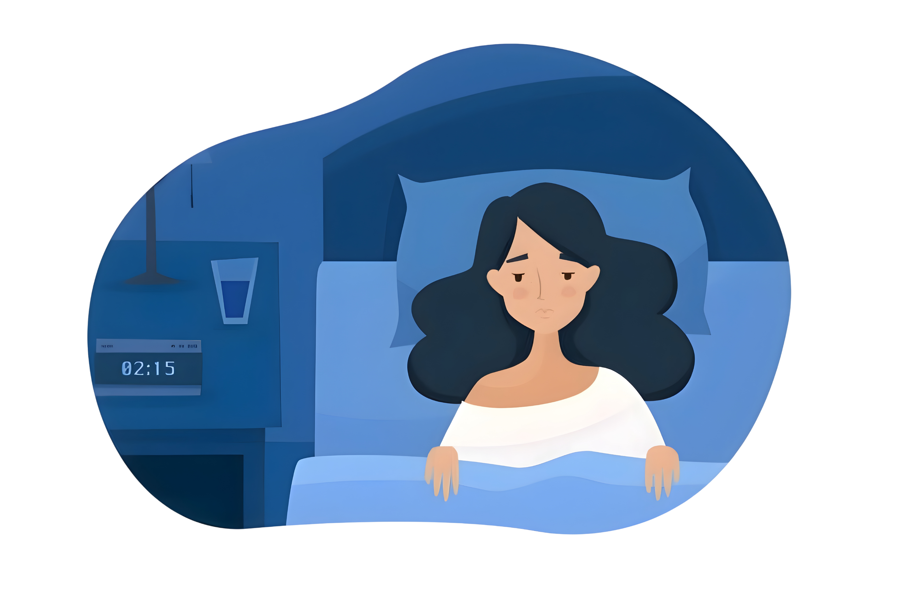

# 💤 SleepInc: SleepScope Analysis  

## 📘 Overview  
SleepInc has shared anonymized sleep data from their popular sleep tracking app **SleepScope**. The goal of this analysis is to explore how **occupation** and **BMI category** influence **sleep duration**, **sleep quality**, and the **presence of sleep disorders**.  

The analysis identifies occupational groups with poor sleep outcomes and evaluates how different BMI categories relate to the likelihood and type of sleep disorders, particularly **Insomnia**.  

---

## 💾 Dataset: `sleep_health_data.csv`  

The dataset contains anonymized records of **374 individuals**, summarizing their average sleep and lifestyle metrics over six months of usage.  

| Column | Description |
|---------|----------------------------------------|  
| `Person ID` | An identifier for each individual. |
| `Gender` | The gender of the person (Male/Female). |  
| `Age` | The age of the person in years. |
| `Occupation` | The occupation or profession of the person. |
| `Sleep Duration (hours)` | The average number of hours the person sleeps per day. |
| `Quality of Sleep (scale: 1-10)` | A subjective rating of the quality of sleep, ranging from 1 to 10. |
| `Physical Activity Level (minutes/day)` | The average number of minutes the person engages in physical activity daily. |  
| `Stress Level (scale: 1-10)` | A subjective rating of the stress level experienced by the person, ranging from 1 to 10. |
| `BMI Category` | The BMI category of the person (Normal, Overweight, Obese). |
| `Blood Pressure (systolic/diastolic)` | The average blood pressure measurement of the person, indicated as systolic pressure over diastolic pressure. |
| `Heart Rate (bpm)` | The average resting heart rate of the person in beats per minute. |
| `Daily Steps` | The average number of steps the person takes per day. |
| `Sleep Disorder` | The presence or absence of a sleep disorder in the person (None, Insomnia, Sleep Apnea). |

---

## 🧠 Analysis Summary  

### 1. Sleep Duration and Quality by Occupation  
- Grouped individuals by **occupation** and **stress category** (Low, Medium, High).  
- Calculated the **average sleep duration** and **average sleep quality** for each occupation.  
- Identified the **Top 5 occupations** with the **lowest average sleep duration** and **lowest average sleep quality**.  
- These results highlight which professions are more prone to sleep deprivation and poor rest quality.  

### 2. Sleep Disorders by BMI Category  
- Analyzed how many individuals in each **BMI category** (`Normal`, `Overweight`, `Obese`) have been diagnosed with a **sleep disorder**.  
- Counted how many individuals in each BMI group have **Insomnia** or **Sleep Apnea**.  
- Calculated the **ratio of individuals with Insomnia** in each BMI category.
- Visualized these ratios with a bar chart titled **“Insomnia Ratio by BMI Category.”**  

---

## 📊 Visualization  
The **bar chart** shows the ratio of individuals diagnosed with **Insomnia** across BMI categories.  
The results indicate that people with higher BMI levels (Overweight and Obese) are more likely to experience insomnia compared to those in the Normal range.  

---

## 🧩 Tools & Libraries Used  
- **Python**  
- **pandas** – for data handling and grouping  
- **matplotlib** – for creating visualizations  

---

## 🔍 Key Findings  
- **Occupation and Stress:** Certain occupations under higher stress categories recorded **shorter sleep durations** and **lower sleep quality**, indicating a relationship between work-related stress and sleep health.  
- **BMI and Sleep Disorders:**  
  - The majority of individuals with sleep disorders fall under the **Overweight** and **Obese** categories.  
  - Both **Insomnia** and **Sleep Apnea** are more prevalent among higher BMI groups.  
- **Insomnia Ratio:**  
  - The computed ratios show that as BMI increases, so does the **likelihood of being diagnosed with Insomnia**.  
